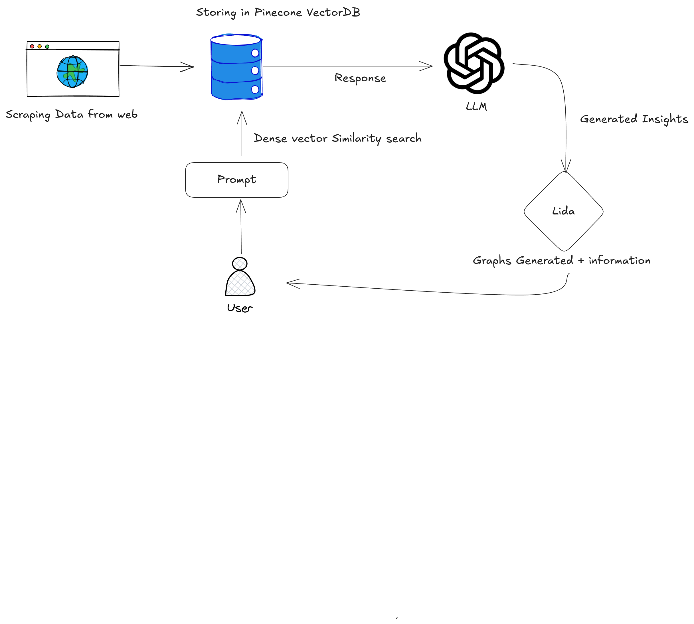
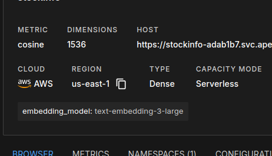

# 📊 Stock Intelligence RAG App

## 🚀 Overview

The **Stock Intelligence RAG App** is an AI-powered system that helps analyze stock data using **Retrieval-Augmented Generation (RAG)**. It combines **LLMs, Pinecone VectorDB, PandasAI, and data visualization** to provide smart insights into the stock market.

With this app, you can:
- **Compare stock performance** across multiple companies.
- **Analyze trends** in market cap, ROE, P/E ratio, and more.
- **Generate AI-driven insights** based on real-time data.
- **Visualize key stock metrics** with interactive graphs.

---

## Architecture


## 📂 Folder Structure

```
Stock Intelligence RAG App
│── __pycache__/             # Compiled Python files
│── .ipynb_checkpoints/      # Jupyter Notebook checkpoints
│── cache/                   # Temporary cache files
│── data/                    # Raw and processed stock data
│── exports/                 # Generated reports and visualizations
│── stockrag/                # Core logic for stock analysis
│── .env                     # Environment variables (API keys, credentials)
│── .gitignore               # Files to ignore in Git
│── app.py                   # Main Streamlit application
│── pandasai.log             # Logs for PandasAI queries
│── Pine_process.py          # Pinecone database processing
│── requirements.txt         # Dependencies for the project
│── scraping.py              # Web scraping logic
│── test.py                  # Unit tests for checking functionality
│── utils.py                 # Utility functions
```

---
## Sample 

## 🔧 Setup Instructions
## First, Go to Pinecone
Create an index, then push scraping data into this using Pine_process.py

### 1️⃣ **Clone the Repository**
```bash
git clone https://github.com/yourusername/stock-intelligence-rag.git
cd stock-intelligence-rag
```

### 2️⃣ **Set Up a Virtual Environment**
```bash
python3 -m venv venv
source venv/bin/activate  # Windows: venv\Scripts\activate
```

### 3️⃣ **Install Dependencies**
```bash
pip install -r requirements.txt
```

### 4️⃣ **Set Up API Keys**
Create a `.env` file in the root directory and add:
```
PINECONE_API_KEY=your_pinecone_api_key
OPENAI_API_KEY=your_openai_api_key
```

### 5️⃣ **Run the Application**
```bash
streamlit run app.py
```

---

## 🏗️ Features

### 🔹 **AI-Driven Stock Analysis**
- Uses **LLMs + Pinecone** to answer stock-related queries.
- Retrieves **real-time stock data** and analyzes trends.
- Suggests **investment insights** based on market data.

### 🔹 **Smart Data Retrieval (RAG)**
- Queries **vector embeddings** for relevant stock information.
- Enhances responses with **AI-generated insights**.

### 🔹 **Web Scraping & Data Processing**
- Scrapes stock data from multiple sources.
- Cleans and structures **financial data** for AI processing.

### 🔹 **Interactive Data Visualization**
- Generates **charts & graphs** using LIDA and Matplotlib.
- Compares stock metrics **visually for better decision-making**.

---

## 📜 How It Works

1. **Ask a question** – Type a stock-related query.
2. **AI retrieves insights** – The app queries Pinecone & processes data.
3. **Charts & graphs** – The system visualizes trends.
4. **Get smart suggestions** – LLM-powered insights help make informed decisions.

---

## 📂 Key Files

| File            | Purpose |
|----------------|---------|
| `app.py`       | Runs the Streamlit web app. |
| `scraping.py`  | Scrapes real-time stock data. |
| `Pine_process.py` | Handles Pinecone VectorDB operations. |
| `utils.py`     | Helper functions for processing data. |
| `test.py`      | Unit tests for validation. |

---

## 🔍 Example Queries

Here are some example queries you can try:

- **"Compare the ROE of HDFC and ICICI Bank."**
- **"What is the stock P/E ratio trend for ITC over 5 years?"**
- **"Which company had the highest dividend yield last year?"**

---

## 📜 License
This project is **MIT Licensed**. Feel free to modify and contribute! 🚀
